# TriageIQ — AI-Powered Support Ticket Intelligence Platform

TriageIQ is a full-stack support ticket intelligence platform that helps support teams manage, classify, route, and analyze customer support tickets. The application allows users to create and manage tickets, automatically classifies tickets using a local AI/NLP-style keyword classifier, routes tickets to the correct support queue, and provides analytics for administrators.

The system supports role-based access control with two roles: **ADMIN** and **AGENT**. Admins can view analytics, manage users, and access all tickets. Agents can view and work on tickets assigned or accessible to them.

---

## Project Overview

Customer support teams often receive large volumes of tickets with different urgency levels, categories, and customer sentiment. Manually reviewing and routing every ticket can slow down response time and increase workload.

TriageIQ solves this problem by:

* Automatically classifying tickets by **category**, **priority**, and **sentiment**
* Routing tickets to the correct support queue
* Allowing manual override when the AI classification is incorrect
* Providing an admin analytics dashboard
* Supporting secure login with JWT authentication
* Enforcing role-based access for admins and agents

This project was built as a full-stack portfolio application with backend APIs, frontend UI, database integration, Docker support, testing, and documentation.

---

## Screenshots

### Login Page


### Admin Dashboard

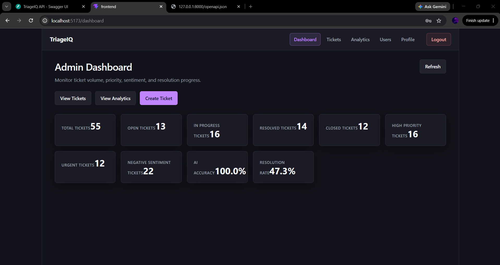

### Admin Ticket List

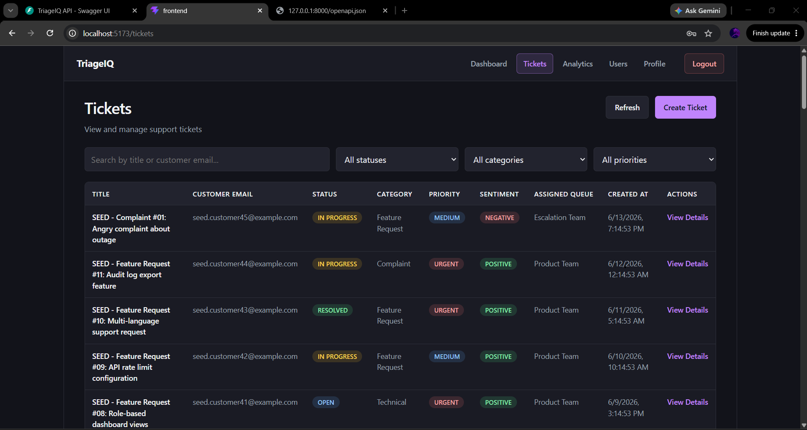

### Ticket Detail with AI Classification

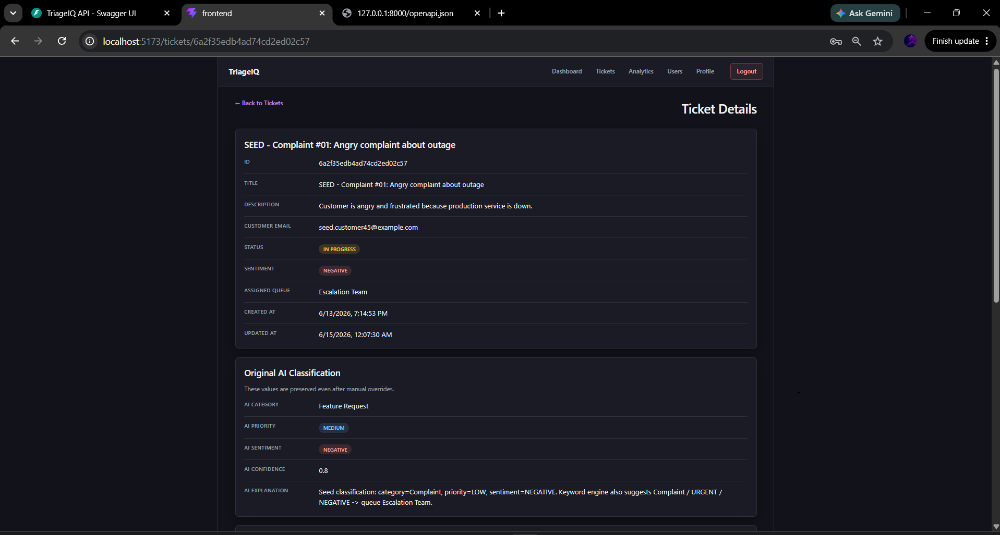

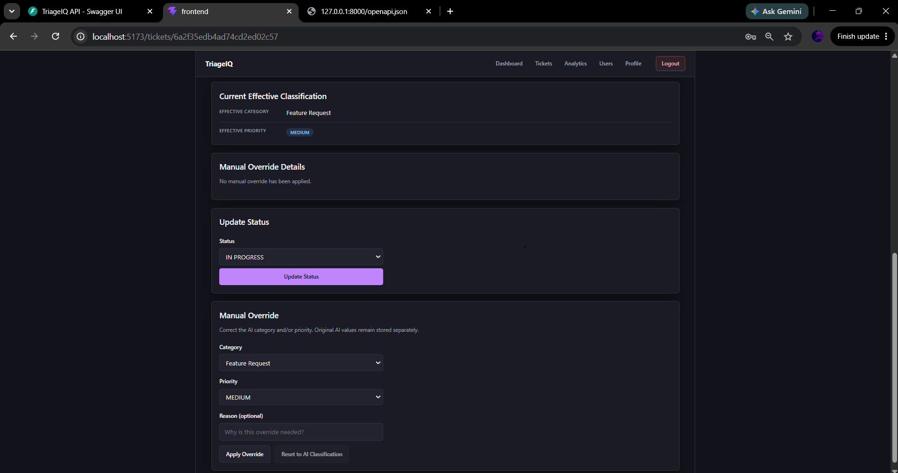

### Create Ticket

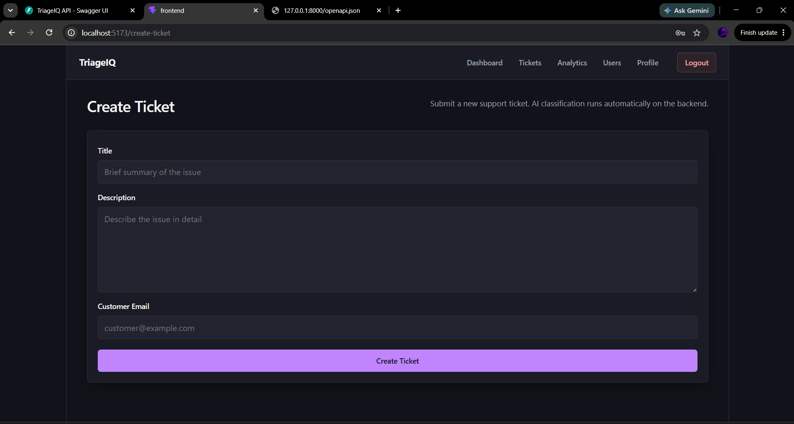

### Analytics Dashboard

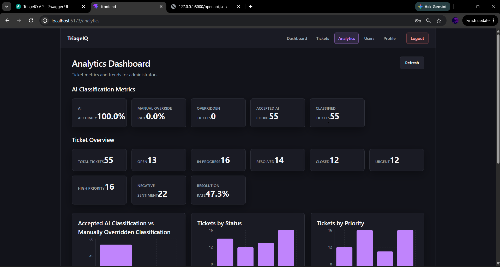

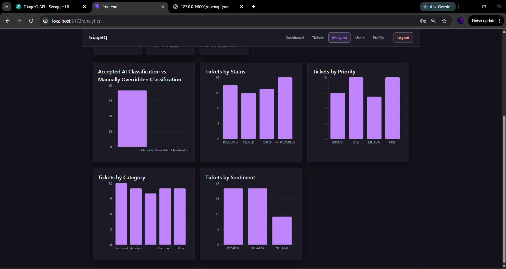

### Admin User Management

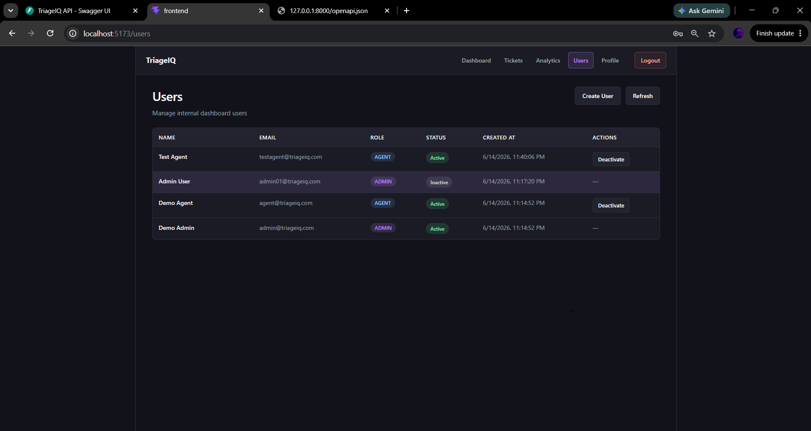

### User Profile

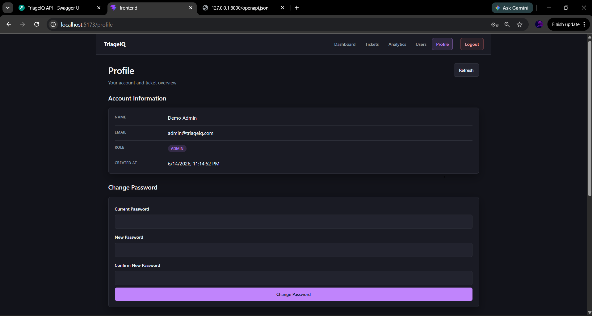

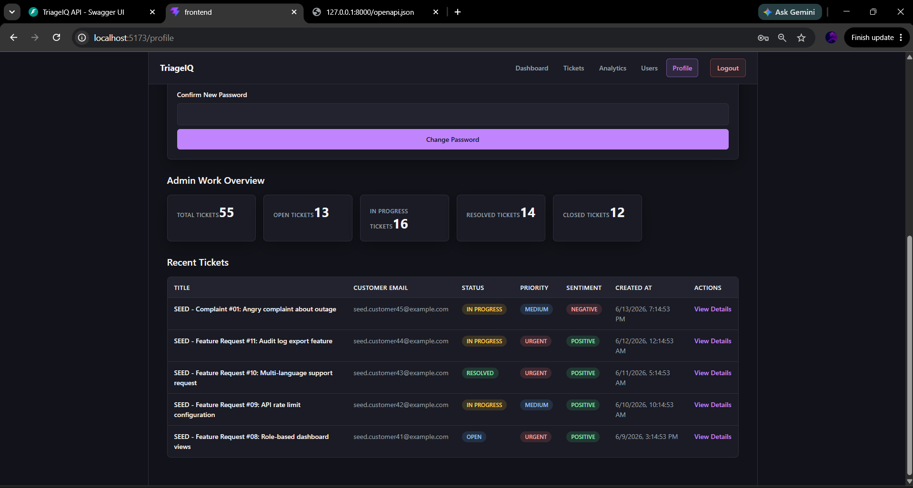

### Agent Ticket View

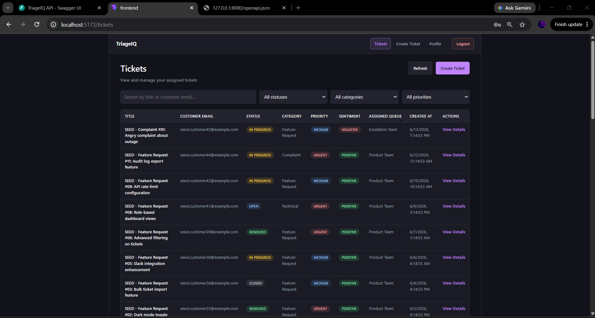

### Swagger API Documentation

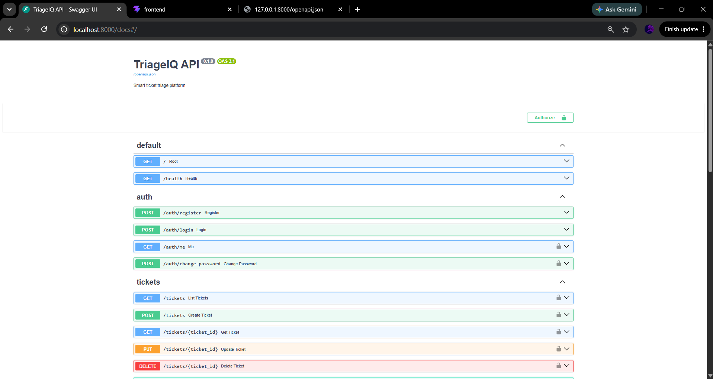

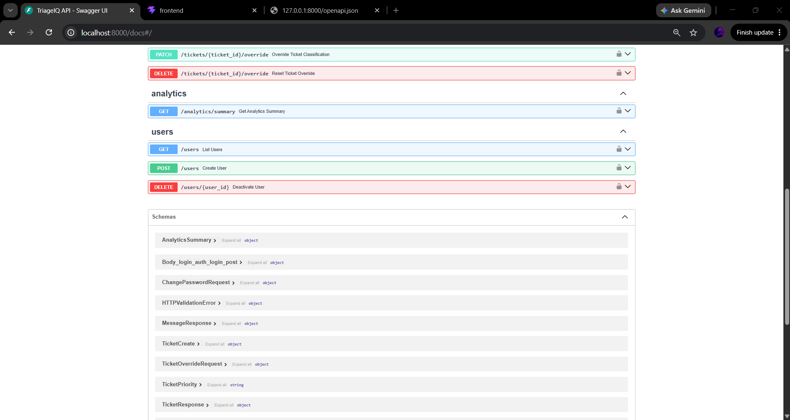

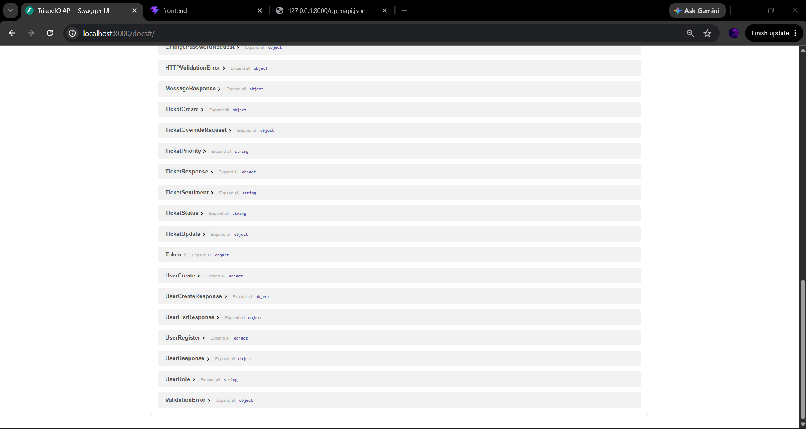

---

## Core Features

* JWT-based authentication
* Role-based access control for `ADMIN` and `AGENT`
* Admin and agent login flows
* Ticket CRUD operations
* Automatic AI classification on ticket creation
* Category, priority, sentiment, confidence score, and explanation generation
* Smart queue routing
* Manual override of AI category and priority
* Original AI values preserved for analytics
* Admin analytics dashboard
* Admin user management
* Agent ticket workflow
* User profile page
* Change password functionality
* Seed demo data
* Docker Compose setup
* Swagger API documentation
* Backend tests with coverage summary
* Frontend lint and build checks
* Optional Kubernetes manifests
* GitHub Actions CI workflow

---

## Tech Stack

| Layer               | Technology                                |
| ------------------- | ----------------------------------------- |
| Frontend            | React, TypeScript, Vite                   |
| Routing             | React Router                              |
| API Calls           | Axios                                     |
| Charts              | Recharts                                  |
| Backend             | FastAPI, Python                           |
| Database            | MongoDB                                   |
| MongoDB Driver      | Motor async driver                        |
| Authentication      | JWT, bcrypt password hashing              |
| Validation          | Pydantic                                  |
| Testing             | pytest, pytest-asyncio, pytest-cov, httpx |
| Linting             | Ruff, ESLint                              |
| Containers          | Docker, Docker Compose                    |
| API Documentation   | Swagger / OpenAPI                         |
| CI/CD               | GitHub Actions                            |
| Optional Deployment | Kubernetes manifests                      |

---

## Why FastAPI Instead of Spring Boot?

Spring Boot is a strong enterprise backend framework commonly used for large-scale Java applications. It provides mature dependency injection, security configuration, production tooling, and strong support for enterprise systems.

However, I chose **FastAPI** for TriageIQ because this project includes an AI/NLP-style classification layer, and Python is better suited for building and extending machine learning or NLP workflows. FastAPI also provides automatic Swagger documentation, strong request validation through Pydantic, async support for MongoDB using Motor, and faster development for a lightweight full-stack project.

For this project timeline and use case, FastAPI was a better fit than Spring Boot because:

* The AI classification logic is easier to build and test in Python
* FastAPI automatically generates Swagger documentation
* Pydantic makes API validation simple and explicit
* Async support works well with MongoDB
* The backend remains lightweight and readable
* It supports rapid development for a portfolio/demo project

Spring Boot would be a good choice for a larger enterprise Java system, but FastAPI was better for this AI-powered support ticket platform.

---

## AI Classification Approach

TriageIQ uses a local keyword-based AI/NLP-style classifier instead of a hosted LLM or paid external API.

When a ticket is created, the classifier analyzes the ticket title and description to predict:

* Category
* Priority
* Sentiment
* Confidence score
* Explanation

The classifier then passes the result to the routing service, which assigns the ticket to the correct support queue.

### Why Local/Mock AI?

The local classifier was chosen because:

* It does not require paid API keys
* It works offline
* It is deterministic and easy to test
* It avoids external API cost
* It is suitable for demos and coursework
* It makes the classification logic transparent

Manual overrides are also supported. When an admin or agent changes the AI-generated category or priority, the original AI values are preserved. This allows the analytics dashboard to calculate AI accuracy and override rate.

---

## Quick Start with Docker Compose

### Prerequisites

Install:

* Docker
* Docker Compose

### Setup

From the repository root, run:

```bash
cp .env.example .env
docker compose up --build -d
docker compose exec backend python scripts/seed_data.py
```

This starts the full application with:

* MongoDB
* FastAPI backend
* React frontend
* Seed demo users
* Seed demo tickets

### Application URLs

| Service      | URL                          |
| ------------ | ---------------------------- |
| Frontend     | http://localhost:5173        |
| Backend API  | http://localhost:8000        |
| Swagger UI   | http://localhost:8000/docs   |
| ReDoc        | http://localhost:8000/redoc  |
| Health Check | http://localhost:8000/health |

### Demo Accounts

| Role  | Email                                           | Password  |
| ----- | ----------------------------------------------- | --------- |
| Admin | [admin@triageiq.com](mailto:admin@triageiq.com) | Admin@123 |
| Agent | [agent@triageiq.com](mailto:agent@triageiq.com) | FinalAgent@123 |

### Stop the Application

```bash
docker compose down
```

---

## Environment Variables

Copy `.env.example` to `.env` before running the project.

```bash
cp .env.example .env
```

Do not commit real secrets to GitHub. The `.env.example` file should contain only safe placeholder values.

| Variable             | Used By  | Description                                |
| -------------------- | -------- | ------------------------------------------ |
| `MONGODB_URI`        | Backend  | MongoDB connection string                  |
| `MONGODB_DB`         | Backend  | MongoDB database name                      |
| `JWT_SECRET`         | Backend  | Secret key used to sign JWT tokens         |
| `JWT_ALGORITHM`      | Backend  | JWT signing algorithm                      |
| `JWT_EXPIRE_MINUTES` | Backend  | JWT token expiration time                  |
| `APP_ENV`            | Backend  | Application environment                    |
| `CORS_ORIGINS`       | Backend  | Allowed frontend origins                   |
| `VITE_API_BASE_URL`  | Frontend | Backend API base URL                       |
| `TEST_MONGODB_DB`    | Tests    | Separate MongoDB database used for testing |

Example `.env.example`:

```env
MONGODB_URI=mongodb://mongo:27017/triageiq
MONGODB_DB=triageiq
JWT_SECRET=replace-with-your-own-secret
JWT_ALGORITHM=HS256
JWT_EXPIRE_MINUTES=60
APP_ENV=development
CORS_ORIGINS=http://localhost:5173
VITE_API_BASE_URL=http://localhost:8000
TEST_MONGODB_DB=triageiq_test
```

---

## API Documentation

After starting the backend, API documentation is available at:

* Swagger UI: http://localhost:8000/docs
* OpenAPI JSON: http://localhost:8000/openapi.json
* ReDoc: http://localhost:8000/redoc

Swagger can be used to test authentication, users, tickets, analytics, and profile endpoints.

---

## Main API Endpoints

| Method   | Endpoint                    | Description                          |
| -------- | --------------------------- | ------------------------------------ |
| `POST`   | `/auth/register`            | Register a user                      |
| `POST`   | `/auth/login`               | Login and receive JWT token          |
| `GET`    | `/auth/me`                  | Get current authenticated user       |
| `GET`    | `/users`                    | Admin: view users                    |
| `POST`   | `/users`                    | Admin: create user                   |
| `GET`    | `/users/me`                 | View current user profile            |
| `PUT`    | `/users/me/change-password` | Change current user password         |
| `POST`   | `/tickets`                  | Create ticket with AI classification |
| `GET`    | `/tickets`                  | View tickets based on role           |
| `GET`    | `/tickets/{id}`             | View ticket details                  |
| `PUT`    | `/tickets/{id}`             | Update ticket                        |
| `DELETE` | `/tickets/{id}`             | Delete ticket                        |
| `GET`    | `/analytics/summary`        | Admin analytics summary              |
| `GET`    | `/health`                   | Health check endpoint                |

---

## Postman Collection

A Postman collection is available at:

```text
docs/postman/TriageIQ.postman_collection.json
```

Set the Postman `baseUrl` variable to:

```text
http://localhost:8000
```

Use the login request to get a JWT token, then use that token for protected endpoints.

---

## Seed Data

The seed script creates demo users and realistic support tickets.

Run with Docker:

```bash
docker compose exec backend python scripts/seed_data.py
```

Run locally:

```bash
cd backend
python scripts/seed_data.py
```

The seed data includes:

* Demo admin account
* Demo agent account
* Multiple sample tickets
* Different categories
* Different priorities
* Different sentiments
* Assigned queues
* Manual override examples for analytics

The script is idempotent, so running it multiple times will not duplicate existing seed data.

---

## Testing Instructions

### Backend Tests

From the backend folder, run:

```bash
cd backend
python -m pytest tests -v
```

Run tests with coverage:

```bash
python -m pytest --cov=app --cov-report=term-missing
```

### Frontend Checks

From the frontend folder, run:

```bash
cd frontend
npm run lint
npm run build
```

---

## Coverage Summary

| Metric                       | Value           |
| ---------------------------- | --------------- |
| Backend test framework       | pytest          |
| Coverage tool                | pytest-cov      |
| Test database                | `triageiq_test` |
| Test files                   | 8               |
| Total tests                  | 60              |
| Approximate backend coverage | 92%             |

Covered areas include:

* Authentication
* JWT login flow
* Role-based access control
* Ticket CRUD
* AI classification
* Smart routing
* Manual override logic
* User management
* Analytics summary
* API integration behavior

---

## Docker

Docker Compose starts the full local development environment.

| File                  | Purpose                                  |
| --------------------- | ---------------------------------------- |
| `docker-compose.yml`  | Runs MongoDB, backend, and frontend      |
| `backend/Dockerfile`  | Builds the FastAPI backend container     |
| `frontend/Dockerfile` | Builds the React/Vite frontend container |

Docker Compose maps these ports:

| Service  | Port    |
| -------- | ------- |
| Frontend | `5173`  |
| Backend  | `8000`  |
| MongoDB  | `27017` |

---

## Local Development Setup

Docker Compose is the recommended setup method. However, the project can also be run manually for development.

### Backend

Prerequisites:

* Python 3.13+
* MongoDB running locally

```bash
cd backend
python -m venv .venv
```

Activate virtual environment:

Windows:

```bash
.\.venv\Scripts\activate
```

macOS/Linux:

```bash
source .venv/bin/activate
```

Install dependencies:

```bash
pip install -r requirements.txt
```

Run backend:

```bash
python -m uvicorn app.main:app --reload --host 127.0.0.1 --port 8000
```

### Frontend

Prerequisites:

* Node.js
* npm

```bash
cd frontend
npm ci
npm run dev
```

Open:

```text
http://localhost:5173
```

---

## Role-Based Access Control

TriageIQ supports two roles:

### Admin

Admins can:

* View all tickets
* Create tickets
* Update tickets
* Delete tickets
* View analytics
* Manage users
* View user list
* Deactivate users
* Access admin dashboard

### Agent

Agents can:

* View accessible or assigned tickets
* Create tickets
* View ticket details
* Update ticket status
* Apply manual overrides on accessible tickets
* View their profile

Agents cannot:

* View admin analytics
* Manage users
* Access admin-only pages
* Delete users

RBAC is enforced on both the frontend and backend. The frontend hides restricted pages, and the backend protects endpoints using role checks.

---

## Project Structure

```text
TriageIQ/
├── backend/
│   ├── app/
│   │   ├── api/
│   │   ├── core/
│   │   ├── db/
│   │   ├── models/
│   │   ├── schemas/
│   │   └── services/
│   ├── scripts/
│   └── tests/
├── frontend/
│   ├── src/
│   │   ├── api/
│   │   ├── components/
│   │   ├── pages/
│   │   └── routes/
├── docs/
│   ├── screenshots/
│   ├── postman/
│   ├── ARCHITECTURE.md
│   ├── DEVLOG.md
│   └── AI_USAGE.md
├── k8s/
├── .github/
│   └── workflows/
├── docker-compose.yml
├── .env.example
└── README.md
```

---

## Kubernetes

Optional Kubernetes manifests are included in the `k8s/` folder.

They include example configuration for:

* MongoDB deployment
* Backend deployment
* Frontend deployment
* Services
* ConfigMap
* Secret template

Docker Compose is the recommended setup for local development. Kubernetes manifests are provided as optional deployment references.

---

## Continuous Integration

GitHub Actions workflow is available at:

```text
.github/workflows/ci.yml
```

The CI pipeline runs on push and pull request.

### Backend CI

* Install Python dependencies
* Run Ruff linting
* Run pytest
* Generate coverage

### Frontend CI

* Install Node dependencies
* Run ESLint
* Build frontend

---

## Known Limitations

* The AI classifier is keyword-based, so ambiguous tickets may be misclassified.
* The project does not use a hosted LLM or advanced semantic model.
* There is no email notification system.
* There is no real-time WebSocket ticket update.
* JWT is stored in localStorage instead of httpOnly cookies.
* Refresh token rotation is not implemented.
* Docker frontend uses the Vite development server instead of a production nginx build.
* Kubernetes manifests are examples and do not include Ingress, TLS, or managed MongoDB.
* The system is designed for demo and portfolio use, not production deployment yet.

---

## What I Would Improve With One More Week

With one more week, I would improve the project by adding:

1. **Production frontend deployment**

   * Build frontend as static files
   * Serve using nginx
   * Use environment-based API configuration

2. **Stronger AI classifier**

   * Add embeddings or optional LLM provider
   * Improve accuracy for ambiguous tickets
   * Add confidence tuning

3. **Refresh tokens and httpOnly cookies**

   * Improve authentication security
   * Reduce risk from localStorage token storage

4. **Ticket comments and activity log**

   * Track status changes
   * Track comments
   * Maintain a full audit trail

5. **End-to-end tests**

   * Use Playwright or Cypress
   * Test login, ticket creation, overrides, and analytics

6. **Production Kubernetes deployment**

   * Add Ingress
   * Add TLS
   * Add Helm chart
   * Use managed MongoDB

7. **Real-time updates**

   * Add WebSocket or polling
   * Refresh ticket list automatically

---

## Additional Documentation

* [Architecture](docs/ARCHITECTURE.md)
* [Development Log](docs/DEVLOG.md)
* [AI Tool Usage](docs/AI_USAGE.md)

---

## Final Notes

TriageIQ demonstrates a complete full-stack application with authentication, role-based access control, ticket management, AI-style classification, routing, analytics, Docker support, testing, and documentation. The project is designed to show practical backend, frontend, database, and AI integration skills in one portfolio-ready application.
