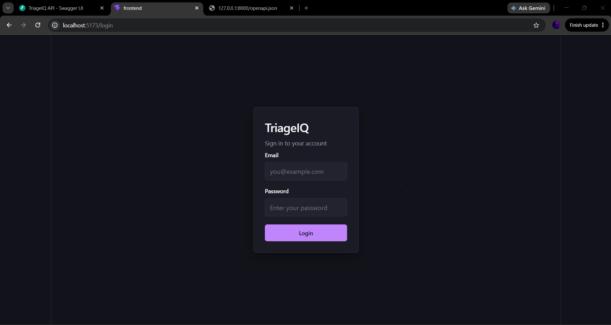

# TriageIQ

TriageIQ is a full-stack support ticket triage platform that classifies incoming tickets with a local keyword-based AI engine, routes them to support queues, and lets agents or admins apply manual overrides when the AI is wrong. Administrators get analytics on ticket volume, resolution rates, and AI accuracy.

## Core features

- **JWT authentication** with bcrypt password hashing and role-based access (`ADMIN`, `AGENT`)
- **Ticket CRUD** with automatic AI classification on create (category, priority, sentiment, confidence, explanation)
- **Smart queue routing** (Billing Support, Technical Support, Escalations, Product Team, etc.)
- **Manual override** of AI category/priority with preserved original AI values, reset-to-AI, and override audit metadata
- **Admin analytics dashboard** with ticket breakdowns, AI accuracy, override rate, and charts
- **Admin user management** — create and deactivate users (soft delete)
- **Agent workflow** — view assigned tickets, create tickets, update status, apply overrides on accessible tickets
- **Seed data script** — 55 realistic demo tickets and demo admin/agent accounts
- **Docker Compose** for local full-stack development
- **Kubernetes manifests** (optional) for cluster deployment
- **GitHub Actions CI** — backend lint/tests and frontend lint/build on every push and PR

## Screenshots

Add screenshots to `docs/screenshots/` for submission. Suggested captures:

| File | View |
|------|------|
| `login.png` | Login page |
| `dashboard.png` | Admin dashboard |
| `tickets.png` | Ticket list with filters |
| `ticket-detail.png` | Ticket detail with AI classification and manual override |
| `analytics.png` | Admin analytics with AI accuracy metrics |
| `users.png` | Admin user management |

Example markdown once images are added:

```markdown


```

## Tech stack

| Layer | Technology |
|-------|------------|
| Backend API | FastAPI, Python 3.13, Pydantic v2 |
| Database | MongoDB 7.0 (Motor async driver) |
| Auth | JWT (python-jose), bcrypt (passlib) |
| Frontend | React 19, Vite 8, React Router, Axios, Recharts |
| Testing | pytest, pytest-asyncio, pytest-cov, httpx, Ruff |
| Linting | Ruff (backend), ESLint (frontend) |
| Containers | Docker, Docker Compose |
| Orchestration | Kubernetes (optional manifests in `k8s/`) |
| CI/CD | GitHub Actions |

## Why FastAPI?

FastAPI was chosen for:

- **Automatic OpenAPI/Swagger docs** — every endpoint is documented at `/docs` without extra tooling
- **Pydantic validation** — request/response schemas catch bad input early and keep the API contract explicit
- **Async support** — fits MongoDB access via Motor for concurrent ticket and analytics workloads
- **Small, readable codebase** — routers, services, and schemas stay separated without heavy framework ceremony

## AI classification approach

TriageIQ uses a **local, keyword-based classifier** (`backend/app/services/classifier.py`), not a hosted LLM or external NLP API.

On ticket creation the service:

1. Scans title + description for category keywords (Billing, Technical, Account, Feature Request, Complaint)
2. Derives priority from urgency/error language (LOW → URGENT)
3. Derives sentiment from positive/negative keywords
4. Computes a **confidence score** from keyword match strength
5. Returns a human-readable **explanation** string
6. Passes results to **smart routing** (`backend/app/services/routing.py`) for queue assignment

### Why local/mock NLP?

- **No API keys or cost** — suitable for demos, coursework, and CI without cloud dependencies
- **Deterministic and testable** — pytest can assert exact categories and routes
- **Fast and offline** — classification runs in-process with no network latency
- **Transparent** — rules are readable in code; overrides and analytics measure when rules fail

Manual overrides store original AI values separately so analytics can report **AI accuracy** vs **manual override rate**.

## Quick start (Docker Compose)

**Prerequisites:** Docker and Docker Compose

```bash
# From the repository root
docker compose up --build -d
docker compose exec backend python scripts/seed_data.py
```

| Service | URL |
|---------|-----|
| Frontend | http://localhost:5173 |
| Backend API | http://localhost:8000 |
| Swagger UI | http://localhost:8000/docs |
| ReDoc | http://localhost:8000/redoc |

**Demo accounts** (created by seed script):

| Role | Email | Password |
|------|-------|----------|
| Admin | admin@triageiq.com | Admin@123 |
| Agent | agent@triageiq.com | Agent@123 |

Stop services:

```bash
docker compose down
```

## Local development setup

### Backend

**Prerequisites:** Python 3.13+, MongoDB running locally

```bash
cd backend
python -m venv .venv
# Windows
.\.venv\Scripts\activate
# macOS/Linux
source .venv/bin/activate

pip install -r requirements.txt
cp ../.env.example ../.env   # edit JWT_SECRET
python -m uvicorn app.main:app --reload --host 127.0.0.1 --port 8000
```

### Frontend

**Prerequisites:** Node.js 22+

```bash
cd frontend
npm ci
cp ../.env.example .env.local   # optional: set VITE_API_BASE_URL
npm run dev
```

Open http://localhost:5173 and log in with a seeded or registered user.

### Register users (API only)

There is no public registration page. Use the API (`POST /auth/register`), the Postman collection, or the admin **Users** page to create accounts.

## Environment variables

Copy `.env.example` to `.env` at the repository root (backend reads it from repo root or `backend/.env`).

| Variable | Used by | Description |
|----------|---------|-------------|
| `MONGODB_URI` | Backend | MongoDB connection string |
| `MONGODB_DB` | Backend | Database name (default `triagemiq`) |
| `JWT_SECRET` | Backend | **Required.** Secret for signing JWTs |
| `JWT_ALGORITHM` | Backend | Default `HS256` |
| `JWT_EXPIRE_MINUTES` | Backend | Token lifetime (default `60`) |
| `APP_ENV` | Backend | e.g. `development` |
| `CORS_ORIGINS` | Backend | Comma-separated allowed origins |
| `VITE_API_BASE_URL` | Frontend | Backend URL for browser API calls |
| `TEST_MONGODB_DB` | Tests only | Isolated test DB name (`triageiq_test`) |

Never commit real secrets. Docker Compose uses a dev default for `JWT_SECRET` when unset.

## API documentation

- **Swagger UI:** http://localhost:8000/docs
- **OpenAPI JSON:** http://localhost:8000/openapi.json
- **Health check:** http://localhost:8000/health

## Postman collection

Import the collection from:

```text
docs/postman/TriageIQ.postman_collection.json
```

Set the `baseUrl` variable to `http://localhost:8000` (or your deployed API URL). Use the login request to obtain a JWT, then call protected endpoints.

## Seed data

The seed script inserts **55 tickets** (title prefix `SEED - `) and demo users. It is **idempotent** — re-running skips existing seed tickets.

```bash
# Local
cd backend
python scripts/seed_data.py

# Recreate seed tickets
python scripts/seed_data.py --reset-seed

# Docker
docker compose exec backend python scripts/seed_data.py
```

See `backend/scripts/seed_data.py` for categories, queues, and manual override samples used in analytics testing.

## Testing

Tests use a **separate MongoDB database** (`triageiq_test`) so development data is not modified.

```bash
cd backend
python -m pytest tests -v
python -m pytest --cov=app --cov-report=term-missing
```

### Coverage summary

| Metric | Value |
|--------|-------|
| Test files | 8 (`test_auth`, `test_classifier`, `test_routing`, `test_tickets`, `test_ticket_override`, `test_rbac`, `test_users`, `test_integration_api`) |
| Tests | 60 |
| App coverage | ~92% (via `pytest-cov`) |

Frontend checks:

```bash
cd frontend
npm run lint
npm run build
```

## Docker

| File | Purpose |
|------|---------|
| `docker-compose.yml` | MongoDB, backend, frontend services |
| `backend/Dockerfile` | Python 3.13 slim, uvicorn on port 8000 |
| `frontend/Dockerfile` | Node 22, Vite dev server on port 5173 |

Compose wires `MONGODB_URI=mongodb://mongo:27017/triageiq` and maps ports `27017`, `8000`, and `5173`.

## Kubernetes (optional)

Example manifests live in [`k8s/`](k8s/README.md):

- ConfigMap for non-sensitive configuration
- Deployments and Services for MongoDB, backend, and frontend
- Secret template for `JWT_SECRET` (no real values committed)

Backend connects to MongoDB via the in-cluster service name `triageiq-mongodb:27017`. Docker Compose remains the recommended local path.

## Continuous integration

GitHub Actions workflow: [`.github/workflows/ci.yml`](.github/workflows/ci.yml)

Runs on **every push and pull request** (all branches):

| Job | Steps |
|-----|-------|
| **Backend** | Python 3.13, Ruff lint, pytest with coverage, MongoDB 7.0 service container |
| **Frontend** | Node 22, `npm ci`, ESLint, production build |

CI uses test-only secrets (`JWT_SECRET=ci-test-jwt-secret-not-for-production`).

## Project structure

```text
TriageIQ/
├── backend/           # FastAPI app, tests, seed script
├── frontend/          # React + Vite SPA
├── docs/              # ARCHITECTURE.md, DEVLOG.md, AI_USAGE.md, Postman
├── k8s/               # Kubernetes manifests
├── .github/workflows/ # CI pipeline
└── docker-compose.yml
```

## Known limitations

- **Keyword classifier** — accuracy depends on keyword overlap; ambiguous tickets may misclassify
- **No hosted LLM** — no semantic understanding beyond configured rules
- **No email/notification system** — tickets are in-app only
- **Frontend auth** — JWT stored in `localStorage`; no refresh-token rotation
- **Route protection** — UI hides admin nav links by role; API enforces RBAC on the server
- **Agent ticket visibility** — agents see only tickets assigned to them (unless admin)
- **Docker frontend** — runs Vite dev server, not a production nginx static build
- **Kubernetes** — example manifests only; no Ingress/TLS or managed MongoDB included
- **Screenshots** — not bundled; add to `docs/screenshots/` for submissions

## What I would improve with one more week

1. **Production frontend build** — multi-stage Docker image serving static assets behind nginx with environment-based API URL
2. **Stronger classifier** — optional pluggable provider (local embeddings or API) behind the same interface
3. **Refresh tokens and httpOnly cookies** — more secure session handling
4. **Ticket comments and activity log** — audit trail beyond override metadata
5. **E2E tests** — Playwright covering login, ticket create, override, and analytics
6. **Ingress + Helm chart** — production-ready Kubernetes packaging with secrets management
7. **Real-time updates** — WebSocket or polling for ticket list refresh

## Additional documentation

- [Architecture](docs/ARCHITECTURE.md)
- [Development log](docs/DEVLOG.md)
- [AI tool usage](docs/AI_USAGE.md)
